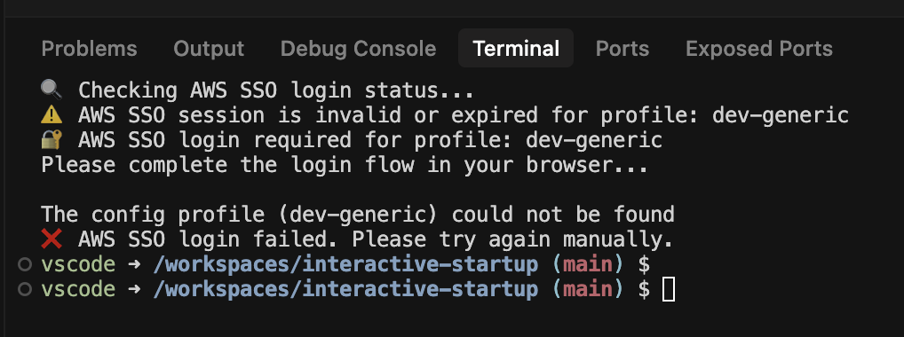

# Interactive Startup

This example illustrates how to run interacive scripts when Terminals open. 

# How This Works

1. There is an interactive script that can create a desired state (here: The user is logged into AWS). If the desired state is already reached, the script should be mostly silent.
2. Register the scipt for your shell. Depending on your shell and your linux user, the way to do this can vary. Here: Use the Dockerfile to add the script to `/etc/bash.bashrc`

